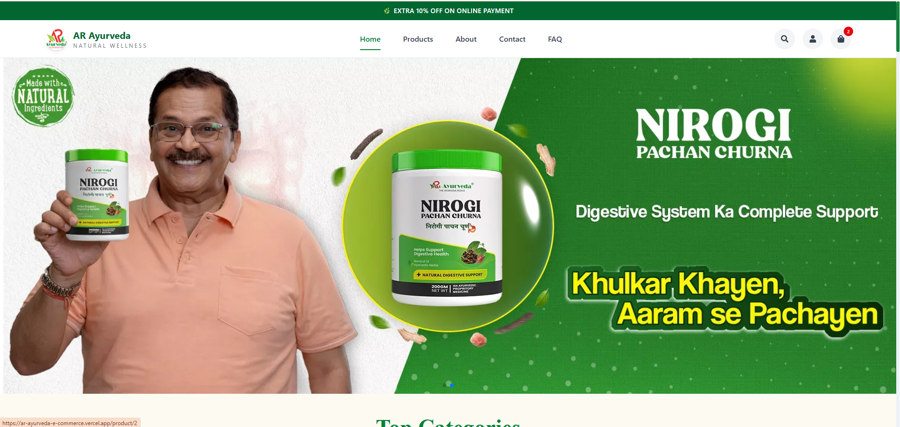

AR Ayurveda E-Commerce Website Review & Improvement Suggestions

Live Website: https://www.arayurveda.shop/
Prototype (React Redesign): https://ar-ayurveda-e-commerce.vercel.app/
________________________________________
Overall Impression
The AR Ayurveda website provides a clean and informative shopping experience while effectively representing the brand's Ayurvedic identity. The platform includes the essential features expected from an e-commerce website, such as product categorization, filtering, and detailed product information.
While the website is functional and easy to navigate, there are several opportunities to enhance the user experience, improve performance, and adopt a more modern design approach. The proposed improvements focus on creating a smoother, faster, and more engaging shopping journey while maintaining the brand's natural and trustworthy image.
________________________________________
Current Observations & Recommendations
1. Website Architecture
Observation
The website follows a traditional multi-page architecture where each navigation triggers a full page reload. Although this approach is functional, it can make navigation feel slower compared to modern e-commerce platforms.
Recommendation
Migrating the frontend to a React-based Single Page Application (SPA) would provide:
•	Faster page transitions 
•	Reduced loading time 
•	Better user experience 
•	Improved scalability 
•	Reusable UI components 
•	Easier maintenance 
________________________________________
2. Navigation Bar
Observation
The navigation bar is clean, simple, and easy to use.
Suggested Improvements
•	Highlight the active page. 
•	Add an underline or visual indicator for the selected menu. 
•	Improve responsiveness for smaller devices. 
•	Enhance hover effects for better interaction feedback. 
These small improvements help users understand their current location within the website.
________________________________________
3. Homepage
Observation
The homepage includes multiple product sections, such as:
•	Top Categories 
•	Shop by Concern 
•	Our Products 
•	Top Discounted Products 
While these sections showcase the product catalog effectively, some products appear repeatedly, making the homepage longer than necessary.
Recommendation
Simplify the homepage by prioritizing the most valuable content.
Benefits include:
•	Better readability 
•	Faster product discovery 
•	Improved user engagement 
•	Cleaner visual hierarchy 
________________________________________
4. Shop by Concern
Observation
The "Shop by Concern" section is informative but could be more responsive on smaller screens. Product cards become compact on mobile devices, affecting readability.
Recommendation
•	Improve responsive grid layouts. 
•	Increase spacing between cards. 
•	Optimize image sizing for different screen widths. 
•	Maintain consistent card dimensions across devices. 
________________________________________
5. Product Search
Observation
The Products page does not currently provide a search feature.
Recommendation
Adding a product search bar would allow users to quickly locate products, improving navigation and reducing browsing time.
Additional enhancements could include:
•	Live search suggestions 
•	Search by product name 
•	Search by ingredient 
•	Search by concern or category 
________________________________________
6. Product Details Page
Observation
The product information is well organized and includes relevant details.
However, multiple promotional banners and repeated marketing sections reduce the emphasis on the actual product.
Recommendation
Create a more focused product page by emphasizing:
•	Product Images 
•	Benefits 
•	Ingredients 
•	Usage Instructions 
•	Customer Reviews 
•	Related Products 
Reducing unnecessary promotional sections would improve readability and support better purchasing decisions.
________________________________________
Strengths of the Existing Website
Several features are already well implemented and contribute positively to the user experience.
✓ Clean Layout
The interface is organized and easy to navigate, making information accessible.
________________________________________
✓ Product Information Structure
Product details are presented in a logical order, allowing customers to understand each product effectively.
________________________________________
✓ Product Filtering
The filtering system helps users quickly narrow down products based on their preferences, improving discoverability.
________________________________________
✓ Multiple Product View Options
The ability to switch between:
•	List View 
•	Two-Column Grid 
•	Three-Column Grid 
provides flexibility and enhances the shopping experience.
________________________________________
✓ Brand Identity
The website successfully communicates the Ayurvedic and wellness-focused nature of the brand.
________________________________________
Proposed Design Improvements
1. Modern UI Refresh
Redesign the interface using modern e-commerce design principles with:
•	Improved spacing 
•	Better typography 
•	Cleaner layouts 
•	Smooth animations 
•	Enhanced visual hierarchy 
•	Consistent component styling 
________________________________________
2. Nature-Inspired Visual Theme
Since Ayurveda is closely associated with natural wellness, the interface can better reflect this identity by incorporating:
•	Natural green color palette 
•	Soft earthy backgrounds 
•	Organic shapes 
•	Herbal-inspired illustrations 
•	Minimal and premium design aesthetics 
This would strengthen the emotional connection between the brand and its users.
________________________________________
3. Redesigned Product Cards
Enhance product cards with:
•	Larger product images 
•	Improved typography 
•	Cleaner pricing layout 
•	Better discount badges 
•	Modern CTA buttons 
•	Subtle hover animations 
•	Consistent spacing 
These improvements would make products more visually appealing and easier to compare.
________________________________________
4. Homepage Optimization
Reduce repetitive product sections and highlight only the most relevant content.
A streamlined homepage helps users:
•	Find products faster 
•	Focus on key offerings 
•	Experience a cleaner interface 
•	Improve overall engagement 
________________________________________
5. Enhanced Product Pages
Simplify the product detail pages by reducing promotional distractions and prioritizing essential information.
Recommended content hierarchy:
1.	Product Images 
2.	Product Name 
3.	Price 
4.	Benefits 
5.	Ingredients 
6.	Usage Instructions 
7.	Customer Reviews 
8.	Related Products 
This structure supports a more intuitive shopping experience and can improve conversion rates.
________________________________________
6. Performance Improvements
Migrating the frontend to React would provide several technical advantages:
•	Faster client-side navigation 
•	Improved rendering performance 
•	Reusable components 
•	Better code maintainability 
•	Easier scalability for future features 
•	Enhanced overall user experience 
________________________________________
React Prototype Highlights
To demonstrate these improvements, I developed a React-based prototype focusing on a more modern and responsive user experience.
Key Enhancements
•	Modern React-based Single Page Application (SPA) 
•	Improved UI with cleaner layouts and spacing 
•	Responsive design for desktop, tablet, and mobile devices 
•	Nature-inspired color palette aligned with the Ayurveda brand 
•	Redesigned product cards with improved visual hierarchy 
•	Simplified homepage with reduced repetitive content 
•	Better navigation experience with smoother interactions 
•	Optimized component structure for maintainability and scalability 
________________________________________
Conclusion
The existing AR Ayurveda website has a strong foundation and effectively showcases the brand's products. By modernizing the user interface, simplifying the homepage, enhancing responsiveness, optimizing product pages, and adopting a React-based architecture, the platform can deliver a faster, cleaner, and more engaging shopping experience.
These improvements would not only enhance usability and performance but also strengthen the brand's premium, natural identity while aligning the website with modern e-commerce standards and user expectations.
